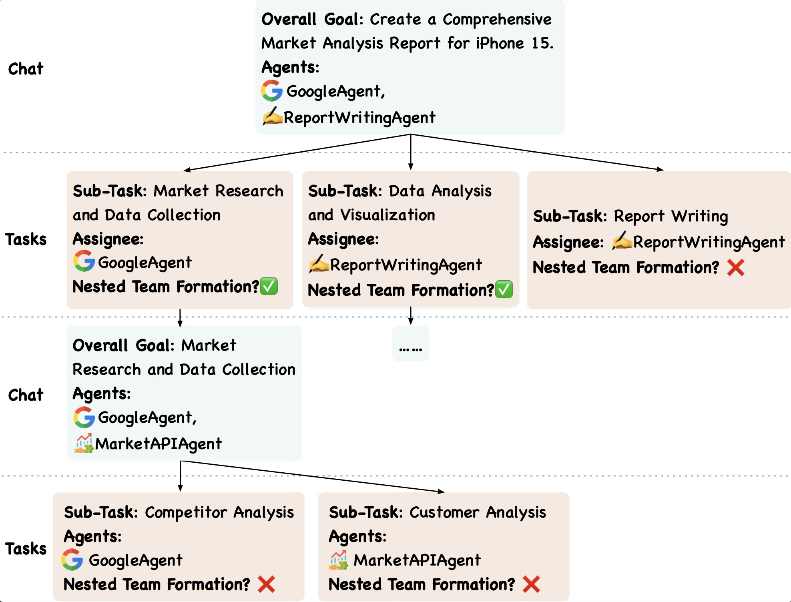
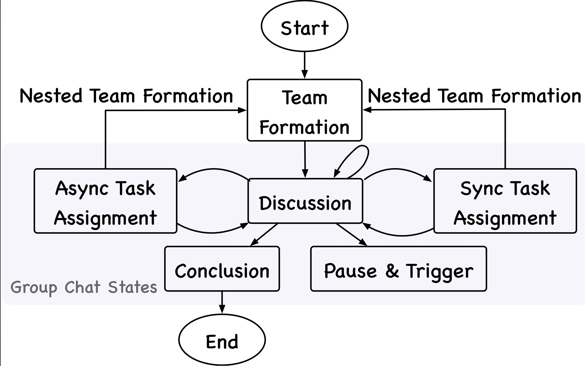

Key Mechanisms
##############

IoA employs several key mechanisms to enable effective collaboration among diverse agents. These mechanisms work together to facilitate agent discovery, team formation, communication, and task execution.

🔍 Agent Registration and Discovery
-----------------------------------
This mechanism allows agents to join the IoA ecosystem and find suitable collaborators for specific tasks.

* **Agent Registration**: When a new agent joins IoA, it registers with the server by providing a comprehensive description of its capabilities, skills, and expertise. This information is stored in the Agent Registry Block of the server's Data Layer.

* **Agent Discovery**: Agents can search for collaborators using the :code:`search_client` tool provided by the server's Agent Query Block. This tool leverages the information in the Agent Registry to match agents based on desired characteristics or capabilities.

🤝 Autonomous Nested Team Formation
-----------------------------------
This mechanism enables dynamic and flexible team creation, allowing agents to form hierarchical structures for complex tasks.

* **Team Formation Process**: When assigned a task, an agent initiates team formation using the :code:`search_client` and :code:`launch_group_chat` tools. It can recursively form sub-teams as needed for multi-faceted tasks.

* **Nested Team Structure**: This hierarchical approach reduces communication complexity and enhances collaboration efficiency, especially for complex tasks requiring diverse skills.

🗣️ Autonomous Conversation Flow Control
---------------------------------------
This mechanism manages the flow of communication among agents, ensuring structured and efficient dialogues.

* **Sequential Speaking Mechanism**: IoA adopts a basic sequential speaking approach, allowing only one agent to speak at a time to prevent conflicts and ensure clear communication.

* **Finite State Machine for Group Chat States**: The conversation flow is modeled as a finite state machine with states like discussion, task assignment, and conclusion. LLMs in the clients autonomously determine state transitions, adapting to the collaboration's needs.

📋 Task Assignment and Execution
--------------------------------
This mechanism handles the allocation and execution of tasks within the agent network.

* **Task Representation**: Tasks are represented as tuples containing a description and a set of potential sub-tasks.

* **Task Allocation**: Tasks can be allocated either synchronously (pausing the group chat until completion) or asynchronously (allowing parallel execution).

* **Task Execution**: Responsible agents execute allocated tasks and report back to the group chat. The pause & trigger state ensures all necessary information is available before proceeding to subsequent collaboration stages.

These mechanisms work in concert to create a flexible, efficient, and scalable environment for multi-agent collaboration in IoA.